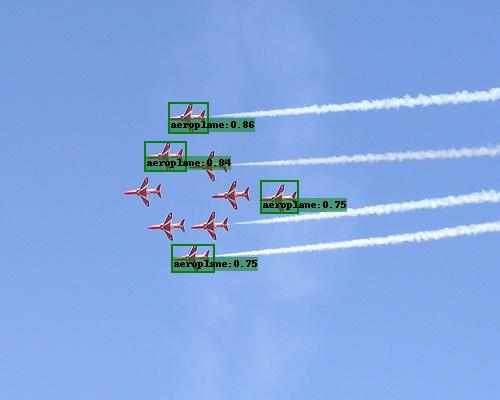
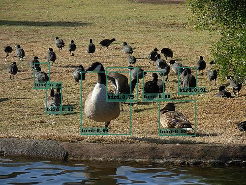

# The pytorch implement of MA-SSD


This repository implements MA-SSD (Multi Attention SSD for Fast Detection of Small Objects). 
 The implementation is based on the projects [lufficc/SSD](https://github.com/lufficc/SSD).


| MA-SSD        | SSD |
| :-----------: |:-------------:|
|  |  |
|  |  |


## New Features in This Implementation
- **Fast Small Object Detection** MA-SSD outperforms SSD on detection especially in small object detection task. MA-SSD runs over 100 FPS on single RTX 2080 Ti GPU. In Quadro P2000 GPU, it also runs over 23 FPS(SSD is 28 FPS).
- **Neck Structure** In `ssd/modeling/neck/`, you can add or modifiy neck module. Neck module always be employed between backbone and head.
- **Inference Speed Calculation** While you running `demo.py`, it is not only detect objects in specify image folder but also calculate FPS for each image and avgerage FPS for all image. 
- **Multi Attention Module**
- **Feature Fusion Module**


## Installation
### Requirements

1. Python3
1. PyTorch 1.0 or higher
1. yacs
1. [Vizer](https://github.com/lufficc/Vizer)
1. GCC >= 4.9
1. OpenCV


### Installation Steps

```bash
git clone https://github.com/kevinchan04/MA-SSD.git
cd MA-SSD
# Required packages: torch torchvision yacs tqdm opencv-python vizer
pip install -r requirements.txt

# It's recommended to install the latest release of torch and torchvision.
```

### Setting Up Datasets
#### Pascal VOC

For Pascal VOC dataset, make the folder structure like this:
```
VOC_ROOT
|__ VOC2007
    |_ JPEGImages
    |_ Annotations
    |_ ImageSets
    |_ SegmentationClass
|__ VOC2012
    |_ JPEGImages
    |_ Annotations
    |_ ImageSets
    |_ SegmentationClass
|__ ...
```
Where `VOC_ROOT` default is `datasets` folder in current project, you can create symlinks to `datasets` or `export VOC_ROOT="/path/to/voc_root"`.

#### COCO

For COCO dataset, make the folder structure like this:
```
COCO_ROOT
|__ annotations
    |_ instances_valminusminival2014.json
    |_ instances_minival2014.json
    |_ instances_train2014.json
    |_ instances_val2014.json
    |_ ...
|__ train2014
    |_ <im-1-name>.jpg
    |_ ...
    |_ <im-N-name>.jpg
|__ val2014
    |_ <im-1-name>.jpg
    |_ ...
    |_ <im-N-name>.jpg
|__ ...
```
Where `COCO_ROOT` default is `datasets` folder in current project, you can create symlinks to `datasets` or `export COCO_ROOT="/path/to/coco_root"`.

## Evaluate

### Single GPU evaluating

```bash
# for example, evaluate SSD300:
python test.py --config-file configs/vgg_att_ssd300_neckthreemed_voc0712.yaml --ckpt https://github.com/kevinchan04/MA-SSD/releases/download/1.0/vgg_att_ssd300_voc0712_neckthreemed.pth
```

### Multi-GPU evaluating

```bash
# for example, evaluate SSD300 with 4 GPUs:
export NGPUS=4
python -m torch.distributed.launch --nproc_per_node=$NGPUS test.py --config-file configs/vgg_ssd300_voc0712.yaml --ckpt https://github.com/kevinchan04/MA-SSD/releases/download/1.0/vgg_att_ssd300_voc0712_neckthreemed.pth
```

## Demo

Predicting image in a folder is simple, it will calculate avgerage speed of inference(FPS):
```bash
python demo.py --config-file configs/vgg_ssd300_voc0712.yaml --images_dir demo --ckpt https://github.com/kevinchan04/MA-SSD/releases/download/1.0/vgg_att_ssd300_voc0712_neckthreemed.pth
```
Then it will download and cache `vgg_att_ssd300_voc0712_neckthreemed.pth` automatically and predicted images with boxes, scores and label names will saved to `demo/result` folder by default.

<!-- You will see a similar output:
```text
(0001/0005) 004101.jpg: objects 01 | load 010ms | inference 033ms | FPS 31
(0002/0005) 003123.jpg: objects 05 | load 009ms | inference 019ms | FPS 53
(0003/0005) 000342.jpg: objects 02 | load 009ms | inference 019ms | FPS 51
(0004/0005) 008591.jpg: objects 02 | load 008ms | inference 020ms | FPS 50
(0005/0005) 000542.jpg: objects 01 | load 011ms | inference 019ms | FPS 53
``` -->

## Train
### Single GPU training

```bash
# for example, train SSD300:
python train.py --config-file configs/vgg_att_ssd300_neckthreemed_voc0712.yaml
```
### Multi-GPU training

```bash
# for example, train SSD300 with 4 GPUs:
export NGPUS=4
python -m torch.distributed.launch --nproc_per_node=$NGPUS train.py --config-file configs/vgg_att_ssd300_neckthreemed_voc0712.yaml 
```
The configuration files that I provide assume that we are running on single GPU. When changing number of GPUs, hyper-parameter (lr, max_iter, ...) will also changed. The learning rate is the sum of all GPUs, which means if you are training on 4 GPUs, lr should be set as `1e-3`. According to our experiments, larger lr always requires more warm-up iterations. The `max_iter` also is the sum on all GPUs.


## MODEL ZOO
### Origin Paper:

|         | VOC2007 test | coco test-dev2015 |
| :-----: | :----------: |   :----------:    |
| SSD300* |     77.2     |      25.1         |
| SSD512* |     79.8     |      28.8         |

### COCO:

| Backbone       | Neck     | Input Size  |          box AP                  | Model Size |  Download |
| :------------: | :----------:| :----------:|   :--------------------------:   | :--------: | :-------: |
|  VGG16         | neckthreemed|     300     |          26.5                    |  372MB     | [model](https://github.com/kevinchan04/MA-SSD/releases/download/1.0/vgg_att_ssd300_coco_neckthreemed.pth)   |


### PASCAL VOC:

| Backbone         | Neck     | Input Size  |          mAP                     | Model Size | Download  |
| :--------------: | :----------:| :----------:|   :--------------------------:   | :--------: | :-------: |
|  VGG16           | neckthreemed|     300     |          79.9                    |   307MB    | [model](https://github.com/kevinchan04/MA-SSD/releases/download/1.0/vgg_att_ssd300_voc0712_neckthreemed.pth)  |

`neckthreemed` is multi attention with feature fusion neck. Please refer to paper with more details about comparsion with other methods.


<!-- ## Develop Guide

If you want to add your custom components, such as new neck, backbone, please see [DEVELOP_GUIDE.md](DEVELOP_GUIDE.md) for more details. -->


<!-- 
## Citations
If you use this project in your research, please cite this project.
```text
@misc{lufficc2018ssd,
    author = {Congcong Li},
    title = {{High quality, fast, modular reference implementation of SSD in PyTorch}},
    year = {2018},
    howpublished = {\url{https://github.com/lufficc/SSD}}
} 
```-->
